Thyroid Disease Analysis
================
Sean Theisen
5/25/2024

- [Introduction](#introduction)
- [Analysis of Correlations](#analysis-of-correlations)
- [Statistical Analysis of
  Correlations](#statistical-analysis-of-correlations)
- [Stepwise Regression](#stepwise-regression)
- [Tree Model](#tree-model)
- [kNN Classifier](#knn-classifier)
- [Conclusion](#conclusion)

# Introduction

The following dataset was gathered from Kaggle.com and was collected
from the UCI Machine Learning Repository The goal of this project is to
analyse the effects of various factors that result in thyroid disease
recurrence of well differentiated thyroid cancer. The factors are:

1.  Age: The age of the patient at the time of diagnosis or treatment.
2.  Gender: The gender of the patient (male or female).
3.  Smoking: Whether the patient is a smoker or not.
4.  Hx Smoking: Smoking history of the patient (e.g., whether they have
    ever smoked).
5.  Hx Radiotherapy: History of radiotherapy treatment for any
    condition.
6.  Thyroid Function: The status of thyroid function, possibly
    indicating if there are any abnormalities.
7.  Physical Examination: Findings from a physical examination of the
    patient, which may include palpation of the thyroid gland and
    surrounding structures.
8.  Adenopathy: Presence or absence of enlarged lymph nodes (adenopathy)
    in the neck region.
9.  Pathology: Specific types of thyroid cancer as determined by
    pathology examination of biopsy samples.
10. Focality: Whether the cancer is unifocal (limited to one location)
    or multifocal (present in multiple locations).
11. Risk: The risk category of the cancer based on various factors, such
    as tumor size, extent of spread, and histological type.
12. T: Tumor classification based on its size and extent of invasion
    into nearby structures.
13. N: Nodal classification indicating the involvement of lymph nodes.
14. M: Metastasis classification indicating the presence or absence of
    distant metastases.
15. Stage: The overall stage of the cancer, typically determined by
    combining T, N, and M classifications.
16. Response: Response to treatment, indicating whether the cancer
    responded positively, negatively, or remained stable after
    treatment.
17. Recurred: Indicates whether the cancer has recurred after initial
    treatment.

In this report you will first find statistical analysis of the dataset
with the hopes of determining the influential variables in thyroid
disease recurrence, followed by a number of models developed to predict
it based on said variables

# Analysis of Correlations

``` r
#Statistical Analysis
res <- cor(encoded_data)
corrplot(res, method='color')
```

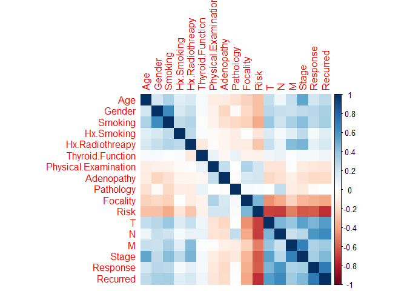

The following correlation matrix gave the following promising variables:

1.  T
2.  N
3.  Gender
4.  Smoking
5.  Age

Here are the corresponding correlation tests. These tests were done with
the “pearson” method

``` r
cor.test(encoded_data$T, encoded_data$Recurred)$p.value
```

    ## [1] 1.741654e-32

``` r
cor.test(encoded_data$N, encoded_data$Recurred)$p.value
```

    ## [1] 3.710287e-44

``` r
cor.test(encoded_data$Gender, encoded_data$Recurred)$p.value
```

    ## [1] 4.546791e-11

``` r
cor.test(encoded_data$Smoking, encoded_data$Recurred)$p.value
```

    ## [1] 2.192081e-11

``` r
cor.test(encoded_data$Age, encoded_data$Recurred)$p.value
```

    ## [1] 2.776541e-07

# Statistical Analysis of Correlations

The following represent only those whos cancer recurred

``` r
recurred <- subset(encoded_data, Recurred == 1)
# Loop through each column except the first one (assuming the first column is 'recurred')
correlated_df <- encoded_data[, c("Recurred", "Gender", "Smoking", "Age", "T", "N")]
```

``` r
gender_counts <- table(correlated_df[["Gender"]])
names(gender_counts) <- c("F", "M")
plot1 <- barplot(gender_counts, main = "Gender")
```

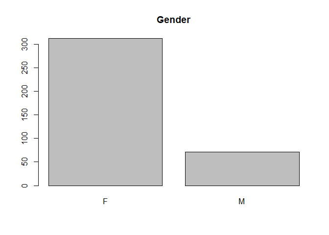

``` r
smoking_counts <- table(correlated_df[["Smoking"]])
names(smoking_counts) <- c("No", "Yes")
plot2 <- barplot(smoking_counts, main = "Smoking")
```

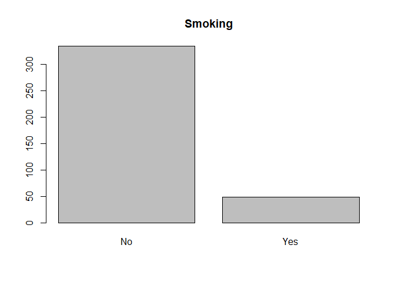

``` r
mean(smoking_counts["No"])
```

    ## [1] 334

``` r
age_counts <- table(correlated_df[["Age"]])
plot3 <- barplot(age_counts, xlab="Age", ylab="Freq", main="Age")
```

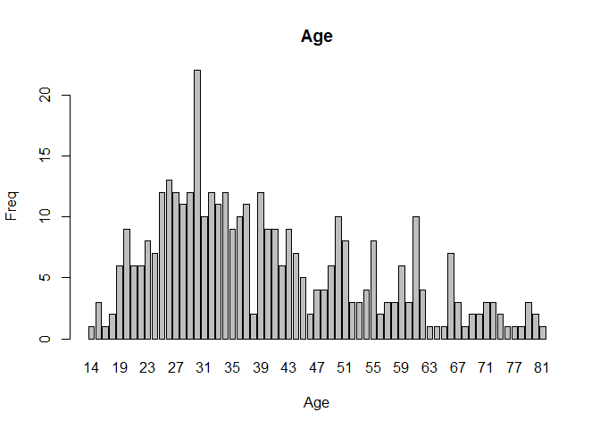

``` r
T_counts <- table(correlated_df[["T"]])
plot4 <- barplot(T_counts, main="T")
```

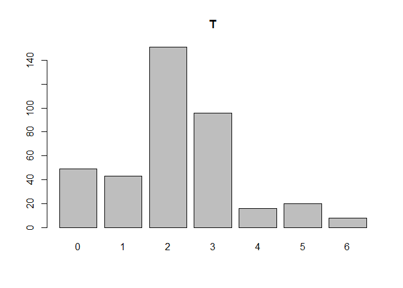

``` r
N_counts <- table(correlated_df[["N"]])
plot5 <- barplot(N_counts, main="N")
```

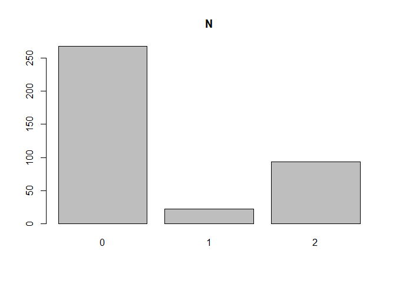

# Stepwise Regression

Here I choose to utilize Stepwise Regression with the significant
variables (T, N, Gender, Smoking, Age) to further narrow my variables

``` r
lm <- lm(Recurred ~ T + N + Gender + Smoking + Age, data=encoded_data)
step.model <- stepAIC(lm, direction="both", trace=0)
srm <- lm(Recurred ~ T + N + Gender + Age, data=encoded_data)
step.model$coefficients
```

    ##  (Intercept)            T            N       Gender          Age 
    ## -0.248510736  0.092106846  0.246961804  0.132810517  0.004227633

``` r
summary(srm)
```

    ## 
    ## Call:
    ## lm(formula = Recurred ~ T + N + Gender + Age, data = encoded_data)
    ## 
    ## Residuals:
    ##      Min       1Q   Median       3Q      Max 
    ## -0.77382 -0.16654 -0.04562  0.10054  1.00844 
    ## 
    ## Coefficients:
    ##              Estimate Std. Error t value Pr(>|t|)    
    ## (Intercept) -0.248511   0.048136  -5.163 3.94e-07 ***
    ## T            0.092107   0.013945   6.605 1.35e-10 ***
    ## N            0.246962   0.021216  11.641  < 2e-16 ***
    ## Gender       0.132811   0.043474   3.055 0.002411 ** 
    ## Age          0.004228   0.001101   3.841 0.000144 ***
    ## ---
    ## Signif. codes:  0 '***' 0.001 '**' 0.01 '*' 0.05 '.' 0.1 ' ' 1
    ## 
    ## Residual standard error: 0.3123 on 378 degrees of freedom
    ## Multiple R-squared:  0.5246, Adjusted R-squared:  0.5196 
    ## F-statistic: 104.3 on 4 and 378 DF,  p-value: < 2.2e-16

The model chosen by the stepwise regression removes the Smoking
variable, and provides us with a statistically significant p-value.
Despite this, the following plots show evidence of non-linearity, and
therefore show the model is not entirely reliable.

``` r
grid.arrange(plot(srm, which=1), plot(srm, which=2), plot(srm, which=3), plot(srm, which=4), ncol=2)
```

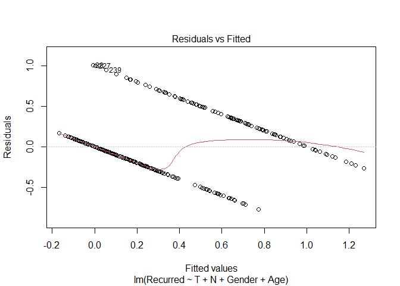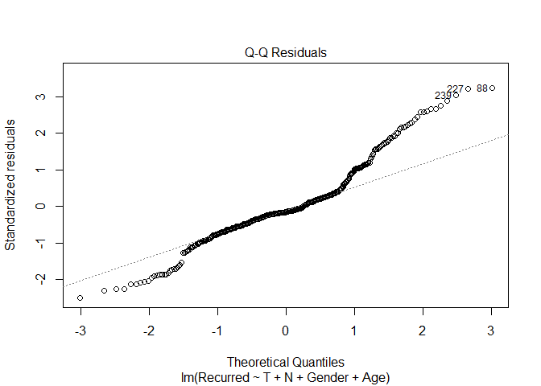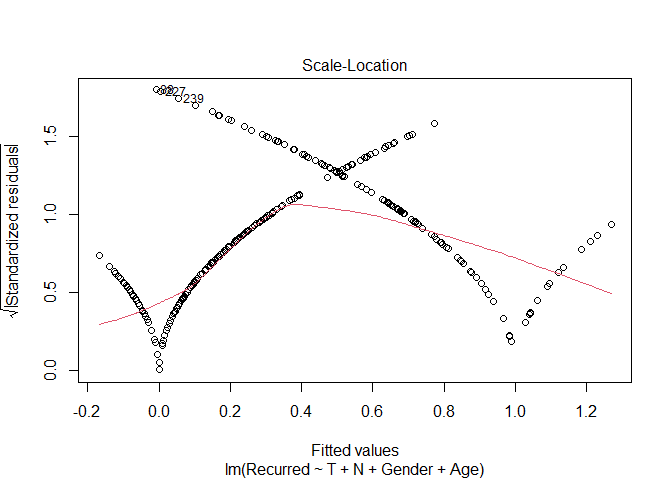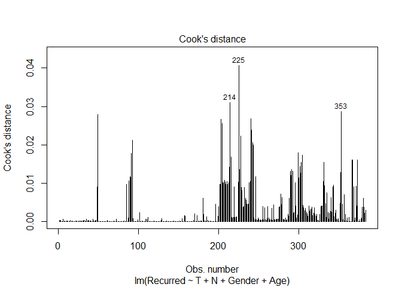

# Tree Model

Here I decide to use a tree model, utilizing the ANOVA method, and
pruned.

``` r
fit <- rpart(Recurred ~ T + N + Gender + Smoking + Age, data=encoded_data, method="anova")
fit_cp <- printcp(fit)
```

    ## 
    ## Regression tree:
    ## rpart(formula = Recurred ~ T + N + Gender + Smoking + Age, data = encoded_data, 
    ##     method = "anova")
    ## 
    ## Variables actually used in tree construction:
    ## [1] Age N   T  
    ## 
    ## Root node error: 77.546/383 = 0.20247
    ## 
    ## n= 383 
    ## 
    ##         CP nsplit rel error  xerror     xstd
    ## 1 0.378074      0   1.00000 1.00719 0.049895
    ## 2 0.077797      1   0.62193 0.70199 0.063998
    ## 3 0.055048      2   0.54413 0.65833 0.067076
    ## 4 0.022933      3   0.48908 0.57812 0.063213
    ## 5 0.011260      4   0.46615 0.56156 0.061512
    ## 6 0.010000      5   0.45489 0.56838 0.062027

``` r
optimal_cp <- fit_cp[which.min(fit_cp[,"xerror"]),"CP"]
pruned_fit <- prune(fit, cp = optimal_cp)
rpart.plot(pruned_fit)
```

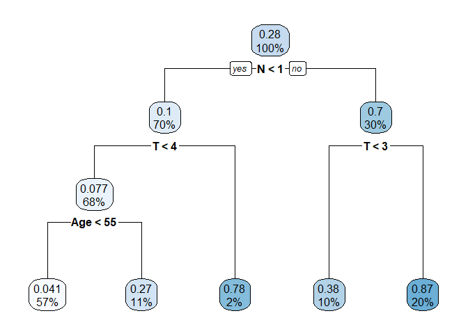<!-- -->

The following is analysis of the tree model

``` r
pred <- predict(pruned_fit, encoded_data)
mse <- mean((encoded_data$Recurred - pred)^2)
rsq <- 1 - sum((encoded_data$Recurred - pred)^2) / sum((encoded_data$Recurred - mean(encoded_data$Recurred))^2)
cat("MSE: ", mse, "\nR-squared:", rsq, "\n")
```

    ## MSE:  0.09438056 
    ## R-squared: 0.5338522

``` r
par(mfrow = c(2, 2))
# Residuals vs Fitted
plot(pred, residuals = encoded_data$Recurred - pred, main = "Residuals vs Fitted")
```

    ## Warning in plot.window(...): "residuals" is not a graphical parameter

    ## Warning in plot.xy(xy, type, ...): "residuals" is not a graphical parameter

    ## Warning in axis(side = side, at = at, labels = labels, ...): "residuals" is not
    ## a graphical parameter

    ## Warning in axis(side = side, at = at, labels = labels, ...): "residuals" is not
    ## a graphical parameter

    ## Warning in box(...): "residuals" is not a graphical parameter

    ## Warning in title(...): "residuals" is not a graphical parameter

``` r
abline(h = 0, col = "red")

# Q-Q Plot of Residuals
qqnorm(encoded_data$Recurred - pred)
qqline(encoded_data$Recurred - pred, col = "red")

# Scale-Location Plot
plot(pred, sqrt(abs(encoded_data$Recurred - pred)), main = "Scale-Location")
abline(h = 0, col = "red")

# Cook's Distance
cooksd <- cooks.distance(lm(Recurred ~ ., data = encoded_data))
plot(cooksd, main = "Cook's Distance")
abline(h = 4/length(encoded_data$Recurred), col = "red")
```

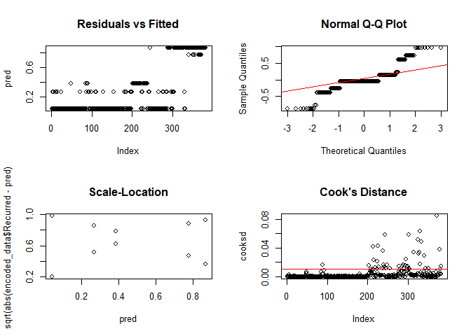<!-- -->

# kNN Classifier

### kNN selection

The following is the result of utilizing the k values
1,3,5,7,9,15,19,25,50 in a kNN algorithm of all of the variables.

``` r
split <- sample.split(encoded_data, SplitRatio=.7)
train_cl <- subset(encoded_data, split=="TRUE")
test_cl <- subset(encoded_data, split=="FALSE")
train_scale <- subset(train_cl[, 1:17])
test_scale <- subset(test_cl[, 1:17])
k_values <- c(1,3,5,7,9,15,19,25,50)
accuracy_values <- sapply(k_values, function(k){
  classifier_knn <- knn(train = train_scale,
                        test = test_scale,
                        cl = train_cl$Recurred,
                        k=k)
  1-mean(classifier_knn != test_cl$Recurred)
})
accuracy_data <- data.frame(K = k_values, Accuracy=accuracy_values)
ggplot(accuracy_data, aes(x = K, y = Accuracy)) +
  geom_line(color = "lightblue", size = 1) +
  geom_point(color = "lightgreen", size = 3) +
  labs(title = "Model Accuracy for Different K Values",
       x = "Number of Neighbors (K)",
       y = "Accuracy") +
  theme_minimal()
```

    ## Warning: Using `size` aesthetic for lines was deprecated in ggplot2 3.4.0.
    ## ℹ Please use `linewidth` instead.
    ## This warning is displayed once every 8 hours.
    ## Call `lifecycle::last_lifecycle_warnings()` to see where this warning was
    ## generated.

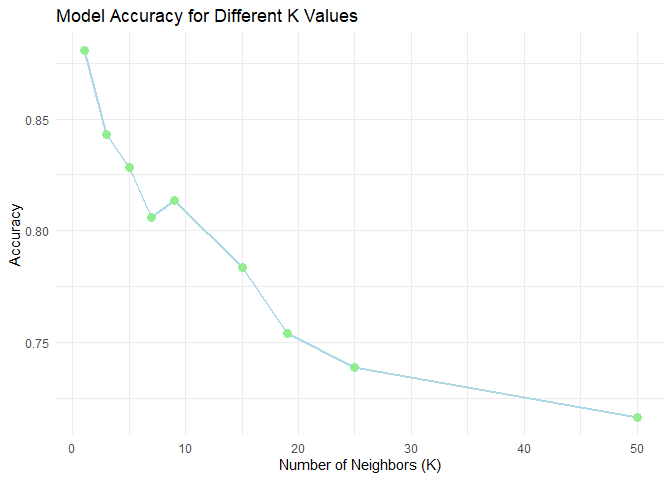<!-- -->

### k = 1

This shows that a model using k = 1 is the most accurate, the following
is further analysis of that model

``` r
classifier_knn <- knn(train = train_scale,
                        test = test_scale,
                        cl = train_cl$Recurred,
                        k=1)
acc <- 1-mean(classifier_knn != test_cl$Recurred)
cm <- table(test_cl$Recurred, classifier_knn)
print(paste("Accuracy: ", acc))
```

    ## [1] "Accuracy:  0.880597014925373"

``` r
plot(classifier_knn, col=rainbow(2), main="Classification of Recurrence", xlab="Recurrence (0=No, 1=Yes)")
```

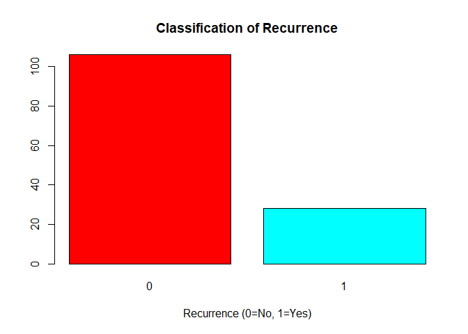<!-- -->

# Conclusion

Overall, the following models provided interesting insight into what
factors affect the recurrence of Thyroid disease, with the kNN algorithm
proving to be the most accurate.

Author: Sean Theisen
